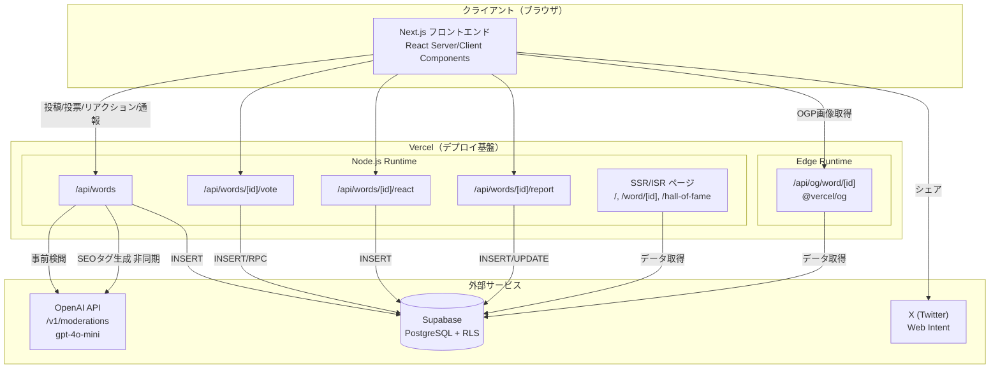
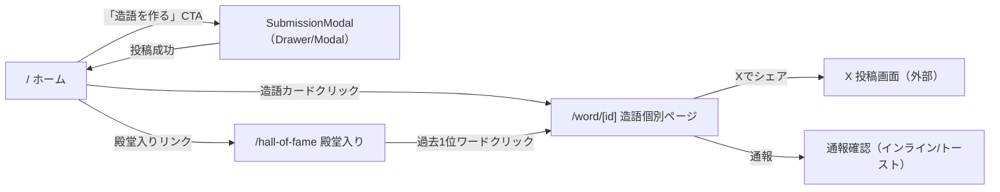
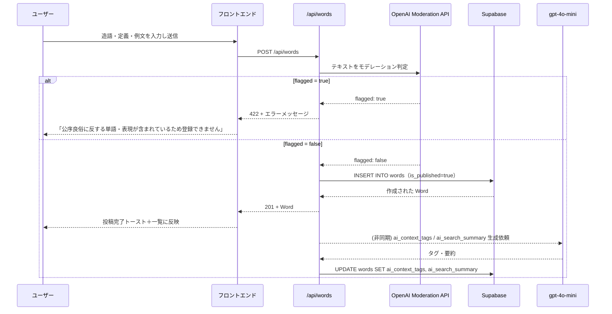
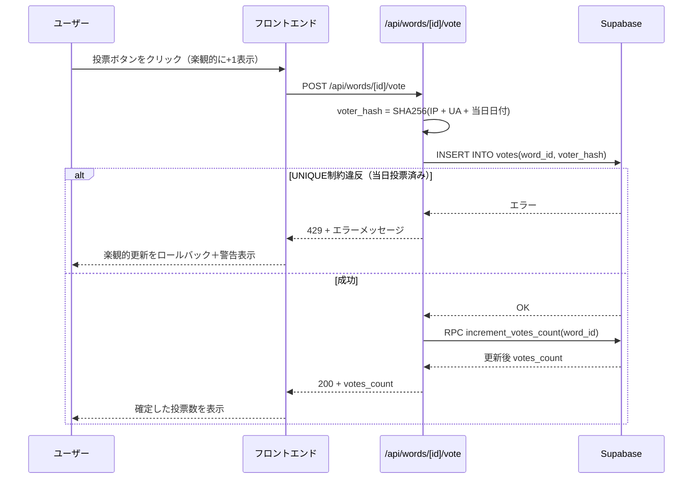
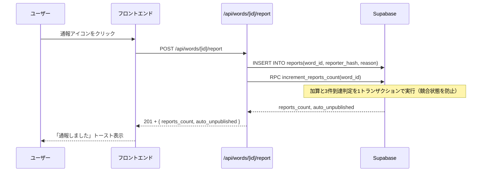
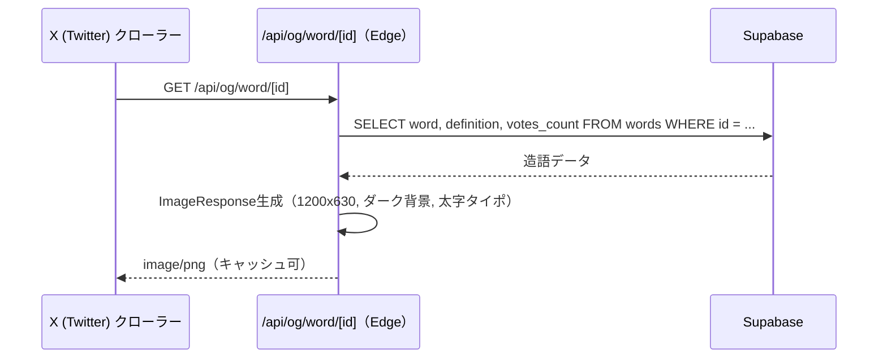

# DicTopia（ディクトピア）詳細設計書

| 項目 | 内容 |
|---|---|
| 文書種別 | 詳細設計書 |
| 対象プロジェクト | DicTopia（ディクトピア） |
| バージョン | v1.0 |
| 作成日 | 2026年8月15日 |
| 前提文書 | DicTopia システム仕様書 v1.0 |

本書は「DicTopia システム仕様書 v1.0」で定義したWHAT（何を作るか）を受け、HOW（どう実装するか）を定義する詳細設計書である。

---

## 1. システムアーキテクチャ



**設計方針の要点**
- 読み取り系（`/`, `/word/[id]`, `/hall-of-fame`）はServer Componentsによるサーバーサイド取得を基本とし、ISRでキャッシュする。
- 書き込み系（投稿・投票・リアクション・通報）はRoute Handler（`/api/*`）経由に一本化し、クライアントからSupabaseへの直接書き込みは行わない（RLSの公開INSERTポリシーはあるが、`voter_hash`生成やAIモデレーションなどサーバー側処理が必須のため、実運用上のエントリーポイントはRoute Handlerに統一する）。
- OGP画像生成のみEdge Runtimeを使用し、レイテンシを最小化する。

---

## 2. ディレクトリ構成（Next.js App Router）

```
dictopia/
├── app/
│   ├── layout.tsx                     # ルートレイアウト（ダークテーマ, Navbar共通化）
│   ├── page.tsx                       # ホーム（お題 / トップ10 / 新着）
│   ├── globals.css
│   ├── word/
│   │   └── [id]/
│   │       ├── page.tsx               # 造語個別ページ（ISR, メタデータ, JSON-LD）
│   │       └── not-found.tsx
│   ├── hall-of-fame/
│   │   └── page.tsx                   # 殿堂入りページ（週別グルーピング）
│   └── api/
│       ├── words/
│       │   ├── route.ts               # POST /api/words
│       │   └── [id]/
│       │       ├── vote/route.ts      # POST /api/words/[id]/vote
│       │       ├── react/route.ts     # POST /api/words/[id]/react
│       │       └── report/route.ts    # POST /api/words/[id]/report
│       └── og/
│           └── word/
│               └── [id]/route.tsx     # GET /api/og/word/[id]（Edge Runtime, ImageResponse）
│
├── components/
│   ├── layout/
│   │   ├── navbar.tsx
│   │   └── footer.tsx
│   ├── home/
│   │   ├── hero-topic-card.tsx
│   │   ├── leaderboard.tsx
│   │   └── newest-list.tsx
│   ├── word/
│   │   ├── word-card.tsx
│   │   ├── vote-button.tsx
│   │   ├── reaction-bar.tsx
│   │   ├── share-button.tsx
│   │   └── report-flag.tsx
│   ├── submission/
│   │   └── submission-modal.tsx
│   └── ui/                            # shadcn/ui 生成コンポーネント
│
├── lib/
│   ├── supabase/
│   │   ├── client.ts                  # ブラウザ用クライアント
│   │   ├── server.ts                  # Server Component / Route Handler用クライアント
│   │   └── admin.ts                   # Service Role（サーバー限定, RLSバイパスが必要な集計等）
│   ├── openai/
│   │   ├── moderation.ts              # モデレーション呼び出しラッパー
│   │   └── enrichment.ts              # SEOタグ・要約生成ラッパー
│   ├── hash.ts                        # voter_hash / reporter_hash 生成
│   ├── week.ts                        # week_code算出・週次リセット時刻計算
│   └── validation.ts                  # zodスキーマ（word/definition文字数制限等）
│
├── types/
│   ├── database.ts                    # Supabase生成型 or 手動定義のDB型
│   └── api.ts                         # APIリクエスト/レスポンス型
│
├── supabase/
│   └── migrations/
│       └── 0001_init.sql              # 仕様書3章のDDL
│
├── public/
├── middleware.ts                       # IP/User-Agent取得補助（必要に応じて）
├── next.config.ts
├── tailwind.config.ts
└── README.md
```

---

## 3. 画面遷移設計



- SubmissionModalはHome / WordDetailどちらからも起動可能なグローバルコンポーネントとする（Navbarの「造語を作る」ボタンから起動）。
- 投稿成功後はトースト通知＋Homeの「新着造語」リストへ楽観的に反映する。

---

## 4. コンポーネント設計

### 4.1 コンポーネントツリー（ホーム画面）

```
app/page.tsx
├── Navbar
│   └── SubmissionModal（トリガー: 「造語を作る」ボタン）
├── HeroTopicCard
│   ├── CountdownTimer
│   └── QuickSubmitInput
├── Leaderboard（今週のバズ造語 Top10）
│   └── WordCard × N
│       ├── VoteButton
│       ├── ReactionBar
│       ├── ShareButton
│       └── ReportFlag
└── NewestList（新着造語）
    └── WordCard × N
```

### 4.2 主要コンポーネントのProps設計

**WordCard**

| Prop | 型 | 説明 |
|---|---|---|
| word | `Word`（types/database.ts） | 表示対象の造語データ |
| variant | `"leaderboard" \| "newest" \| "detail"` | 表示バリエーション（ランキング番号の有無等） |
| onVoteSuccess | `(newCount: number) => void` | 投票成功時の親コンポーネントへのコールバック（楽観的更新用） |

**VoteButton**

| Prop | 型 | 説明 |
|---|---|---|
| wordId | `string` | 対象造語ID |
| initialCount | `number` | 初期投票数 |
| onSuccess | `(newCount: number) => void` | 成功時コールバック |

- 内部状態: `status: "idle" | "voting" | "voted" | "limited"` をuseStateで管理。
- `HTTP 429`受信時は`status = "limited"`とし、ボタンを無効化＋「本日はこの造語にすでに投票済みです」をツールチップ表示。

**ReactionBar**

| Prop | 型 | 説明 |
|---|---|---|
| wordId | `string` | 対象造語ID |
| emojiTypes | `("fire" \| "laugh" \| "cry" \| "clap")[]` | 表示する絵文字種別（固定4種） |

**SubmissionModal**

| Prop | 型 | 説明 |
|---|---|---|
| activeTopic | `Topic \| null` | 現在のお題（未指定投稿も許容） |
| open | `boolean` | 開閉状態 |
| onOpenChange | `(open: boolean) => void` | 開閉制御 |
| onSubmitted | `(word: Word) => void` | 投稿成功時コールバック |

- react-hook-form + zodでフォーム状態とバリデーションを管理。
- 文字数カウンター: `word`は30文字、`definition`は200文字の残数表示をリアルタイム反映。

---

## 5. データ型設計（TypeScript）

### 5.1 データベース型（`types/database.ts`）

```typescript
export type EmojiType = "fire" | "laugh" | "cry" | "clap";

export interface Topic {
  id: string;
  created_at: string;
  title: string;
  description: string | null;
  is_active: boolean;
  week_code: string;
}

export interface Word {
  id: string;
  created_at: string;
  word: string;
  definition: string;
  example_sentence: string | null;
  topic_id: string | null;
  votes_count: number;
  reports_count: number;
  is_published: boolean;
  ai_context_tags: string[];
  ai_search_summary: string | null;
}

export interface Vote {
  id: string;
  created_at: string;
  word_id: string;
  voter_hash: string;
}

export interface Reaction {
  id: string;
  created_at: string;
  word_id: string;
  emoji_type: EmojiType;
}

export interface Report {
  id: string;
  created_at: string;
  word_id: string;
  reason: string | null;
  reporter_hash: string;
}
```

### 5.2 API入出力型（`types/api.ts`）

```typescript
// POST /api/words
export interface CreateWordRequest {
  word: string;            // 1〜30文字
  definition: string;      // 1〜200文字
  example_sentence?: string;
  topic_id?: string;
}
export type CreateWordResponse =
  | { success: true; data: Word }
  | { success: false; error: string }; // 422時: "公序良俗に反する単語・表現が含まれているため登録できません"

// POST /api/words/[id]/vote
export type VoteResponse =
  | { success: true; votes_count: number }
  | { success: false; error: string }; // 429時: "本日はこの造語にすでに投票済みです"

// POST /api/words/[id]/react
export interface ReactRequest {
  emoji_type: EmojiType;
}
export type ReactResponse = { success: true } | { success: false; error: string };

// POST /api/words/[id]/report
export interface ReportRequest {
  reason?: string;
}
export type ReportResponse =
  | { success: true; auto_unpublished: boolean }
  | { success: false; error: string };
```

---

## 6. シーケンス設計

### 6.1 造語投稿フロー



### 6.2 投票フロー



### 6.3 通報・自動非公開フロー



### 6.4 OGP画像生成フロー



---

## 7. API詳細設計

### 7.1 POST /api/words

| 項目 | 内容 |
|---|---|
| リクエストBody | `CreateWordRequest`（`word`必須, `definition`必須, `example_sentence`任意, `topic_id`任意） |
| バリデーション | `word`: 1〜30文字 / `definition`: 1〜200文字（zodで実装） |
| 成功レスポンス | `201 Created`, `CreateWordResponse(success:true)` |
| モデレーション拒否 | `422 Unprocessable Entity`, メッセージ固定文言 |
| バリデーションエラー | `400 Bad Request` |
| サーバーエラー | `500 Internal Server Error` |

### 7.2 POST /api/words/[id]/vote

| 項目 | 内容 |
|---|---|
| リクエストBody | なし |
| 成功レスポンス | `200 OK`, `{ success: true, votes_count }` |
| 重複投票 | `429 Too Many Requests`, メッセージ固定文言 |
| 対象なし | `404 Not Found` |

### 7.3 POST /api/words/[id]/react

| 項目 | 内容 |
|---|---|
| リクエストBody | `{ emoji_type: "fire" \| "laugh" \| "cry" \| "clap" }` |
| 成功レスポンス | `201 Created`, `{ success: true }` |
| 不正な emoji_type | `400 Bad Request` |

### 7.4 POST /api/words/[id]/report

| 項目 | 内容 |
|---|---|
| リクエストBody | `{ reason?: string }` |
| 実装方式 | `increment_reports_count` RPCで加算と自動非公開判定をアトミックに実行する（詳細はSupabaseセットアップ手順書） |
| 成功レスポンス | `201 Created`, `{ success: true, auto_unpublished }` |
| 対象なし | `404 Not Found` |

### 7.5 GET /api/og/word/[id]

| 項目 | 内容 |
|---|---|
| 実行環境 | Edge Runtime |
| 成功レスポンス | `200 OK`, `image/png`（1200×630） |
| 対象なし | フォールバック画像（DicTopiaロゴのみ）を返す |
| キャッシュ | `Cache-Control: public, max-age=60, s-maxage=3600` を推奨 |

---

## 8. 状態管理設計

| 状態 | 管理方法 | 補足 |
|---|---|---|
| 造語一覧（ホーム/殿堂入り） | Server Componentでのフェッチ＋ISR | クライアント側の再フェッチはページ遷移時のみ |
| 投票数・リアクション数 | クライアント側 `useState` による楽観的更新 → API結果で確定 | ロールバック処理を必ず実装 |
| 投稿モーダルの開閉・フォーム状態 | クライアントローカル状態（`useState` / react-hook-form） | グローバルストア（Redux/Zustand等）は不要な規模 |
| 週次リセットカウントダウン | クライアント側 `useEffect` + `setInterval`、`lib/week.ts` の算出ロジックを共通利用 | JST（UTC+9）基準で計算 |

---

## 9. エラーハンドリング方針

| ケース | HTTPステータス | フロントエンド表示 |
|---|---|---|
| モデレーション拒否 | 422 | フォーム上部にインラインエラー表示 |
| 同日重複投票 | 429 | トースト＋投票ボタンを一時的に無効化 |
| バリデーションエラー | 400 | 該当入力欄下にエラーメッセージ（zodメッセージを日本語化） |
| 対象リソースなし | 404 | `not-found.tsx` によるカスタム404ページ |
| サーバー/DBエラー | 500 | 汎用エラートースト「時間をおいて再度お試しください」 |
| OpenAI Moderation API障害時 | 500 | フェイルクローズ方針で確定。モデレーション未確認のまま投稿を許可しない。`500`を返し投稿を失敗させ、フロントエンドは「時間をおいて再度お試しください」を表示する（再試行キュー等の追加インフラはスコープ外） |

---

## 10. 環境変数設計

| 変数名 | 用途 | 使用箇所 |
|---|---|---|
| `NEXT_PUBLIC_SUPABASE_URL` | SupabaseプロジェクトURL | クライアント/サーバー共通 |
| `NEXT_PUBLIC_SUPABASE_ANON_KEY` | Supabase匿名キー | クライアント/サーバー共通 |
| `SUPABASE_SERVICE_ROLE_KEY` | RLSバイパスが必要なサーバー処理用 | `lib/supabase/admin.ts`（サーバー限定、クライアントに露出禁止） |
| `OPENAI_API_KEY` | OpenAI API認証 | `lib/openai/*`（サーバー限定） |
| `NEXT_PUBLIC_SITE_URL` | OGP/メタタグの絶対URL生成 | メタデータ生成、シェアURL生成 |

---

## 11. ディレクトリ別責務まとめ

| ディレクトリ | 責務 |
|---|---|
| `app/` | ルーティング・ページ・Route Handler（Next.js規約に準拠） |
| `components/` | 表示ロジックに専念するUIコンポーネント（DB直接アクセスは行わない） |
| `lib/` | Supabaseクライアント初期化、外部API呼び出し、ハッシュ生成、バリデーション等の共通ロジック |
| `types/` | DB型・API型の一元管理（コンポーネント・APIの両方から参照） |
| `supabase/migrations/` | スキーマ変更履歴の管理（本番反映前にレビュー可能な状態を維持） |

---

## 12. 今後の拡張余地（本設計のスコープ外・参考情報）

- 認証機能を追加する場合は、Supabase Authを`voter_hash`方式と併用し、匿名投票とログインユーザー投票の二層構造に拡張可能。
- 通報後の人間によるレビューフロー（管理画面）は本設計に含まれないため、将来的に`/admin`配下として追加設計が必要。
- 週次お題の自動生成・自動切り替え（Cron/Supabase Edge Functions）は本設計では手動運用を前提としている。
