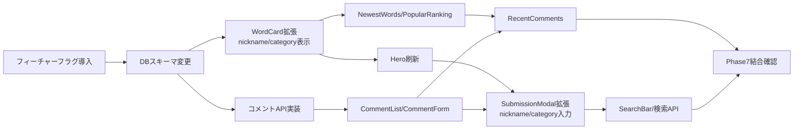

# DicTopia 追加詳細設計書 v1.2

| 項目 | 内容 |
|---|---|
| 文書種別 | 追加詳細設計書（差分） |
| 対象プロジェクト | DicTopia（ディクトピア） |
| バージョン | v1.2（v1.0・v1.1からの差分） |
| 作成日 | 2026年8月22日 |
| 前提文書 | DicTopia_詳細設計書.md v1.0、DicTopia_追加仕様書_v1.2.md |

---

## 1. DBスキーマ変更

### 1.1 `words` テーブルへの列追加

```sql
ALTER TABLE public.words
  ADD COLUMN nickname VARCHAR(30),
  ADD COLUMN category VARCHAR(20) NOT NULL DEFAULT 'その他'
    CHECK (category IN ('ライフスタイル', '感情・感性', '仕事・ビジネス', 'ネット・SNS', '恋愛・人間関係', 'その他'));

CREATE INDEX idx_words_category ON public.words(category);
```

> 既存レコードには `DEFAULT 'その他'` が適用される。新規投稿時はアプリ側でユーザー選択を必須とする（DB制約はデフォルト値のフォールバックに過ぎない）。

### 1.2 `comments` テーブル新規作成

```sql
CREATE TABLE public.comments (
    id UUID PRIMARY KEY DEFAULT uuid_generate_v4(),
    created_at TIMESTAMP WITH TIME ZONE DEFAULT timezone('utc'::text, now()) NOT NULL,
    word_id UUID REFERENCES public.words(id) ON DELETE CASCADE NOT NULL,
    nickname VARCHAR(30),
    body VARCHAR(200) NOT NULL,
    commenter_hash VARCHAR(64) NOT NULL,
    CONSTRAINT comment_body_length CHECK (char_length(body) >= 1)
);

CREATE INDEX idx_comments_word_id ON public.comments(word_id, created_at DESC);
CREATE INDEX idx_comments_created_at ON public.comments(created_at DESC);

ALTER TABLE public.comments ENABLE ROW LEVEL SECURITY;

CREATE POLICY "Allow public read access to comments" ON public.comments FOR SELECT USING (true);
CREATE POLICY "Allow public insert to comments" ON public.comments FOR INSERT WITH CHECK (true);
```

> `commenter_hash`は投票・通報と同じ方式（IP+User-Agent+日付のSHA-256）で生成するが、UNIQUE制約は付けない（同一ユーザーが同じ造語に複数回コメントすることは許可する）。将来的な連投スパム対策のためのログとしてのみ保持する。

### 1.3 `user_id`列の先行追加（要件F）

```sql
ALTER TABLE public.words
  ADD COLUMN user_id UUID REFERENCES auth.users(id) ON DELETE SET NULL;

ALTER TABLE public.comments
  ADD COLUMN user_id UUID REFERENCES auth.users(id) ON DELETE SET NULL;

CREATE INDEX idx_words_user_id ON public.words(user_id);
CREATE INDEX idx_comments_user_id ON public.comments(user_id);
```

> `auth.users`はSupabaseプロジェクトに標準で存在するテーブルのため、Supabase Authを有効化していない現時点でも外部キー制約を張ることができる。今回のAPI実装（3章）では、`POST /api/words`・`POST /api/words/[id]/comments`のいずれも`user_id`に値を設定せず、常に`NULL`のままINSERTする（要件E・Fの通り、認証機能自体が未実装のため）。RLSポリシーの追加・変更は不要（既存の公開INSERT/SELECTポリシーがそのまま適用される）。

---

## 2. コンポーネント設計（ホーム画面刷新）

### 2.1 コンポーネントツリー

```
app/page.tsx
├── Navbar
│   ├── Logo + Tagline
│   ├── SearchBar（新規）
│   ├── 「新語を追加する」CTA → SubmissionModal起動
│   ├── LoginButton（新規、ダミー）
│   └── HamburgerMenu（新規、装飾のみ）
├── Hero（新規、HeroTopicCardの代替）
│   ├── Headline / Subtext
│   ├── CTAButtons（新語を追加する / 使い方を見る）
│   └── IllustrationImage（静的アセット）
├── NewestWords（新規、NewestListの後継）
│   └── WordCard × 3（variant="grid"）
├── PopularRanking（新規、Leaderboardの後継、Top5）
│   └── RankingRow × 5
├── RecentComments（新規）
│   └── CommentFeedItem × N
└── BottomCTA（新規）
```

### 2.2 Props設計（新規・変更コンポーネントのみ）

**SearchBar**

| Prop | 型 | 説明 |
|---|---|---|
| onSearch | `(query: string) => void` | デバウンス後（300ms推奨）に呼び出される |

- 内部で `GET /api/words/search?q=...` を呼び出し、結果をドロップダウン表示する。
- 空文字の場合はドロップダウンを表示しない。

**WordCard（拡張）**

v1.0詳細設計書4.2章のPropsに加え、以下を追加する。

| Prop | 型 | 説明 |
|---|---|---|
| variant | `"leaderboard" \| "newest" \| "detail" \| "grid"` | `"grid"`をNewestWordsのカード表示用に追加 |

- カード内表示項目に `category`（バッジ）、`nickname`（「by ○○」形式、未入力時は「by 名無し」）、相対時間、`comments_count`、リアクション合計数を追加する。
- 「NEW」バッジは `created_at` が24時間以内の場合のみ表示する（クライアント側で判定）。

**PopularRanking**

| Prop | 型 | 説明 |
|---|---|---|
| words | `Word[]`（最大5件、`votes_count`降順） | Server Componentから渡す |

- 1〜3位: メダルアイコン（`ti-medal` 等のTablerアイコン、色は金・銀・銅相当のCSS変数で表現）
- 4〜5位: 数字のみ

**RecentComments**

| Prop | 型 | 説明 |
|---|---|---|
| comments | `CommentWithWord[]`（最大5〜10件、`created_at`降順） | 造語タイトルを含めてJOIN取得したデータ |

**LoginButton**

- クリックハンドラは `alert()` ではなく、既存のトースト実装（`sonner`等、未導入であれば軽量なトーストを追加）で「ログイン機能は近日公開予定です」を表示する。
- 状態は一切持たない（`useState`不要）。

### 2.3 相対時間表示ユーティリティ

`lib/relative-time.ts` を新規作成する。

```typescript
export function toRelativeTime(isoString: string): string {
  const diffMs = Date.now() - new Date(isoString).getTime();
  const diffMin = Math.floor(diffMs / 60000);
  if (diffMin < 60) return `${diffMin}分前`;
  const diffHour = Math.floor(diffMin / 60);
  if (diffHour < 24) return `${diffHour}時間前`;
  const diffDay = Math.floor(diffHour / 24);
  return `${diffDay}日前`;
}
```

---

## 3. API設計

### 3.1 POST /api/words/[id]/comments（新規）

| 項目 | 内容 |
|---|---|
| リクエストBody | `{ nickname?: string; body: string }` |
| バリデーション | `body`: 1〜200文字（必須）、`nickname`: 0〜30文字（任意） |
| 処理フロー | (1) バリデーション → (2) OpenAI Moderation → (3) `commenter_hash`生成 → (4) `comments`へINSERT |
| モデレーション拒否 | `422`、メッセージ「公序良俗に反する表現が含まれているため投稿できません」 |
| 成功レスポンス | `201`、作成された `Comment` |

シーケンスは既存の造語投稿フロー（v1.0詳細設計書6.1章）とほぼ同一のため、当該シーケンス図を流用し、対象テーブルを`comments`に読み替えて実装する。

### 3.2 GET /api/words/search（新規）

| 項目 | 内容 |
|---|---|
| クエリパラメータ | `q`（検索文字列、1文字以上） |
| 実装 | `SELECT * FROM words WHERE is_published = true AND (word ILIKE '%' || q || '%' OR definition ILIKE '%' || q || '%') ORDER BY votes_count DESC LIMIT 20` |
| 成功レスポンス | `200`、`Word[]` |
| 空クエリ | `400` |

### 3.3 GET /api/words/[id]/comments（新規、造語個別ページ用）

| 項目 | 内容 |
|---|---|
| 実装 | `SELECT * FROM comments WHERE word_id = $1 ORDER BY created_at DESC` |
| 成功レスポンス | `200`、`Comment[]` |

> ホーム画面のRecentCommentsは全造語横断のため、`comments`と`words`をJOINした専用クエリ（Server Component内で直接Supabaseクライアントから取得、Route Handler化は不要）とする。

---

## 4. フィーチャーフラグの実装方針

`lib/config.ts` を新規作成する。

```typescript
export const FEATURE_WEEKLY_TOPIC =
  process.env.NEXT_PUBLIC_FEATURE_WEEKLY_TOPIC === "true";
```

- `Hero`コンポーネントは `FEATURE_WEEKLY_TOPIC` を見て、`true`ならv1.1で設計した`HeroTopicCard`を、`false`なら本書2.1章の`Hero`（お題非表示版）をレンダリングする分岐を持つ（両コンポーネントは削除せず共存させる）。
- `SubmissionModal`は`FEATURE_WEEKLY_TOPIC`が`false`の間、お題選択欄そのものをレンダリングしない。

---

## 5. デザインテーマ移行

### 5.1 Tailwind設定
- v1.0で想定していた `bg-slate-950` 基調のダーク配色クラスを、ライトテーマの配色（`bg-white`、プライマリカラーは `indigo-600` 系）に置き換える。
- ダークモード切り替え機能自体は本スコープでは扱わない（v1.0ではダーク/ライト切替を想定していたが、今回はライト単色での実装を優先する。切替機能の再導入は将来のスコープとする）。

### 5.2 影響範囲
- v1.0/v1.1で実装済みの `Navbar` / `HeroTopicCard` / `WordCard` / `SubmissionModal` は配色のみ全面的に置き換える（構造・ロジックは可能な限り流用する）。

---

## 6. 実装順序（依存関係）



- DBスキーマ変更（B）を最初に完了させないと、以降のUI実装がモックデータに依存したままになる。
- `SubmissionModal`の拡張（H）は、`Hero`刷新（D、クイック投稿欄の扱いが変わるため）と`CommentForm`実装（G、UIパターンを流用するため）の両方が完了してから着手する。
